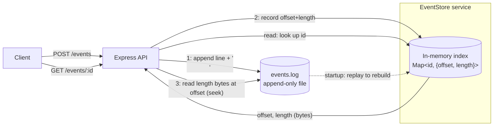

# Append-Only Event Store

A tiny key-value store where **the log file *is* the database**. Every write is appended as one JSON line to `events.log`; an in-memory index records the exact byte location of each event so reads seek straight to it. On restart, the log is replayed to rebuild the index — the same way Postgres and SQLite recover from their write-ahead logs.

No SQLite. No JSON file that gets rewritten. Just an append-only log + an index.

---

## Setup

```bash
# 1. Install
npm install

# 2a. Run in dev (auto-reload, runs the TypeScript directly)
npm run dev

# 2b. Or build + run the compiled output
npm run build
npm start
```

The server listens on `http://localhost:3000` (override with `PORT`). The log file defaults to `./events.log` (override with `LOG_FILE`).

On startup you'll see the recovery line:

```
[recovery] Rebuilt index from .../events.log — recovered N event(s).
[server] Event store listening on http://localhost:3000
```

### Endpoints — curl for every route

**`POST /events`** — store any JSON body. The server stamps `id` + `createdAt`, appends it, and returns `201` with the full event.

```bash
curl -i -X POST http://localhost:3000/events \
  -H "Content-Type: application/json" \
  -d '{"type":"like","postId":"p_123","likerName":"Chidi"}'
```
```json
{ "type":"like", "postId":"p_123", "likerName":"Chidi",
  "id":"956d0bcd-bc39-45ae-abc2-c6dc54687e97",
  "createdAt":"2026-05-31T14:57:38.705Z" }
```

**`GET /events/:id`** — seeks directly to the event's bytes via the index. `404` if the id is unknown.

```bash
curl http://localhost:3000/events/956d0bcd-bc39-45ae-abc2-c6dc54687e97
# unknown id:
curl -i http://localhost:3000/events/nope      # -> 404 {"error":"Event not found"}
```

**`GET /stats`** — `{ total, bytes }`.

```bash
curl http://localhost:3000/stats
# {"total":3,"bytes":358}
```

---

## Architecture



**Write path (`POST /events`)**
1. Stamp the body with a UUID v4 `id` and an ISO `createdAt`.
2. Serialize the event to one JSON line and **append** it plus `\n` to `events.log`.
3. Record `{ offset, length }` (in **bytes**) in the index, where `offset` is the byte where the line starts and `length` is the byte length of the JSON (excluding the newline).

**Read path (`GET /events/:id`)**
1. Look the `id` up in the index → `{ offset, length }`. Miss → `404`.
2. Seek to `offset` and read exactly `length` bytes from the file.
3. Parse that slice and return it. The rest of the file is never touched.

**Recovery (startup)**
Stream `events.log` line by line, tracking a running byte offset. For each valid JSON line, set `index[id] = { offset, length }`. Print the recovered count, *then* start accepting requests.

```
events.log  (bytes →)
┌──────────────────────────────┬──────────────────────────────┬─────────────┐
│ {"id":"a",...}\n              │ {"id":"b",...}\n              │ {"id":"c"...│
└──────────────────────────────┴──────────────────────────────┴─────────────┘
 ^offset=0, len=...              ^offset=...                     ^offset=...
        │                               │                               │
        └───────────────┐               │               ┌───────────────┘
                        ▼               ▼               ▼
              index:  a → {0, L_a}   b → {O_b, L_b}   c → {O_c, L_c}
```

---

## Core concepts (in my own words)

**Why append-only is safer than overwriting in place.** When you overwrite a record in the middle of a file, there's a window where the old bytes are gone but the new bytes aren't fully written. A crash there leaves a half-written record and corrupts data you weren't even touching. Appending never modifies existing bytes — the worst a crash can do is leave a partial line at the *end* of the file, which recovery simply skips. Everything written before it is still intact and readable. That's why every serious database writes to an append-only log first.

**Why an index makes reads fast.** Without an index, finding an event means scanning the file line by line until you hit the matching id — O(file size) per read, and it gets slower as the log grows. The index is a hash map from `id` to the exact byte range, so a read is one O(1) map lookup plus a single seek-and-read of just those bytes. The file can be gigabytes and a read still touches only a few hundred bytes.

**Why offsets are measured in bytes, not characters.** An emoji or accented character is multiple bytes in UTF-8 but one "character". `fs.read` works in bytes, so the index has to store byte offsets and byte lengths (`Buffer.byteLength`) — otherwise any event containing unicode would read back truncated or garbled.

---

## Screenshots

> _Capture these from your own run and drop them in (e.g. in a `docs/` folder)._

**1. Recovery log after a restart** — showing the rebuilt count:

``

**2. A read of a previously-written id after restart:**

``

---

## What I struggled with

> _Draft from the real build — edit into your own voice before submitting._

- **Bytes vs characters.** My first instinct was to use the string length for the index. Reads of plain-ASCII events worked, but an event with an emoji came back truncated. The fix was measuring everything with `Buffer.byteLength(line, 'utf8')` and reading into a `Buffer`, since `fs.read` is byte-based.
- **Getting offsets right during recovery.** `readline` strips the `\n`, so I had to add `+1` per line when accumulating the running offset, and confirm the file always ends in `\n` so the math lines up.
- **Concurrent writes racing on the offset.** Two POSTs arriving together could both read the same `byteOffset` before either finished writing. I serialized appends through a promise chain so each write commits its offset before the next begins.
- **Partial trailing line.** A crash mid-write can leave a half-line at the end. Wrapping the per-line `JSON.parse` in a try/catch lets recovery skip it instead of crashing.

## What I learned

> _Draft — personalize._

- How write-ahead logging and crash recovery actually work, by building the smallest possible version.
- Node's `fs.promises` file handles and **positioned reads** (`read(buffer, 0, length, offset)`) that seek without moving a shared cursor.
- Why "append-only" is a design discipline, not just an API flag — and how databases turn an unordered log into fast random reads with an in-memory index.

## Resources I consulted

> _Add the actual links you used._

- Node.js `fs` / `fs/promises` docs — file handles, `read`, `appendFile`.
- Node.js `readline` docs — streaming a file line by line.
- (add articles / videos / SO threads / AI prompts that helped you)

## Why this project made me a better backend developer

> _Be specific and personal — this section is graded on your own reflection._

Working through this, I can now reason about durability and crash recovery instead of treating the database as a black box: I understand why writes go to a log first, why an index is what makes reads fast, and what actually happens to in-flight data when a process dies. In production I'll think differently about anything that persists state — restart safety, partial writes, and the cost of scanning vs. indexed lookups.

---

## Project structure

```
event-store/
├── src/
│   ├── config.ts                      # port + log file path
│   ├── server.ts                      # recover-then-listen bootstrap
│   ├── app.ts                         # express app, JSON, CORS (*)
│   ├── routes/events.routes.ts        # route wiring
│   ├── controllers/events.controller.ts
│   ├── services/eventStore.service.ts # append-only log + byte-offset index + recovery
│   └── utils/id.ts                    # UUID v4
├── package.json
├── tsconfig.json
└── .gitignore
```
