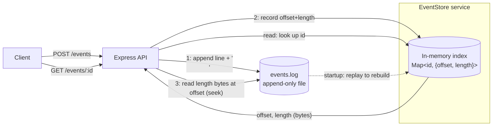
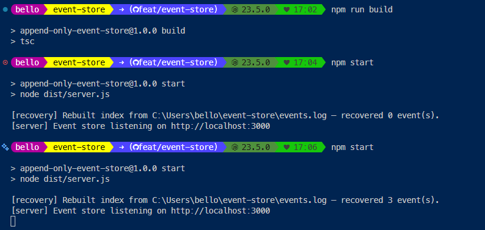
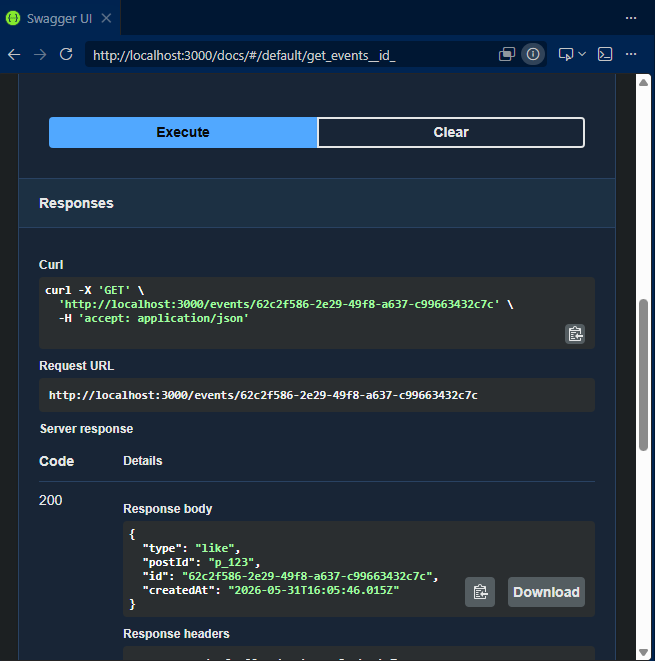
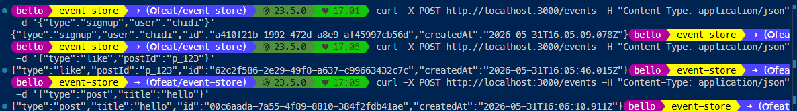
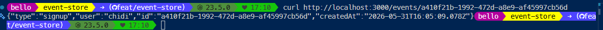

# Append-Only Event Store

A tiny key-value store where **the log file *is* the database**. Every write gets appended as one JSON line to `events.log`, and an in-memory index remembers the exact byte location of each event so reads can jump straight to it. When the server restarts, it replays the log to rebuild that index, which is the same trick Postgres and SQLite use to recover from their write-ahead logs.

No SQLite. No JSON file that gets rewritten on every change. Just an append-only log and an index that points into it.

## Demo (30s)

A short walkthrough of the write → stop → restart → read flow, showing that events survive a restart because the index is rebuilt from the log alone:

▶️ **https://www.loom.com/share/7684a323775146bcbe079791f2ae3037**

---

## Setup

```bash
# 1. Install
npm install

# 2a. Run in dev (auto-reload, runs the TypeScript directly)
npm run dev

# 2b. Or build + run the compiled output
npm run build
npm start
```

The server listens on `http://localhost:3000` (override with `PORT`). The log file defaults to `./events.log` (override with `LOG_FILE`).

On startup you'll see the recovery line:

```
[recovery] Rebuilt index from .../events.log — recovered N event(s).
[server] Event store listening on http://localhost:3000
```

### Interactive docs (Swagger UI)

There's a browsable, click-to-test UI for every endpoint at **`http://localhost:3000/docs`**. It's purely a documentation layer, so clicking around in there doesn't change how anything is stored.

### Endpoints (curl for every route)

**`POST /events`** stores any JSON body. The server stamps it with an `id` and a `createdAt`, appends it to the log, and returns `201` with the full event.

```bash
curl -i -X POST http://localhost:3000/events \
  -H "Content-Type: application/json" \
  -d '{"type":"like","postId":"p_123","likerName":"Chidi"}'
```
```json
{ "type":"like", "postId":"p_123", "likerName":"Chidi",
  "id":"956d0bcd-bc39-45ae-abc2-c6dc54687e97",
  "createdAt":"2026-05-31T14:57:38.705Z" }
```

**`GET /events/:id`** jumps straight to the event's bytes using the index. You get a `404` if the id isn't known.

```bash
curl http://localhost:3000/events/956d0bcd-bc39-45ae-abc2-c6dc54687e97
# unknown id:
curl -i http://localhost:3000/events/nope      # -> 404 {"error":"Event not found"}
```

**`GET /stats`** returns `{ total, bytes }`.

```bash
curl http://localhost:3000/stats
# {"total":3,"bytes":358}
```

---

## Architecture



**Write path (`POST /events`)**
1. Stamp the body with a UUID v4 `id` and an ISO `createdAt`.
2. Serialize the event to one JSON line and **append** it, plus a `\n`, to `events.log`.
3. Record `{ offset, length }` in **bytes** in the index. `offset` is the byte where the line starts, and `length` is the byte length of the JSON (the newline isn't counted).

**Read path (`GET /events/:id`)**
1. Look the `id` up in the index to get `{ offset, length }`. A miss returns `404`.
2. Seek to `offset` and read exactly `length` bytes from the file.
3. Parse that slice and return it. The rest of the file is never touched.

**Recovery (startup)**
Stream `events.log` line by line, tracking a running byte offset. For each valid JSON line, set `index[id] = { offset, length }`. Print the recovered count first, and only then start accepting requests.

```
events.log  (bytes →)
┌──────────────────────────────┬──────────────────────────────┬─────────────┐
│ {"id":"a",...}\n              │ {"id":"b",...}\n              │ {"id":"c"...│
└──────────────────────────────┴──────────────────────────────┴─────────────┘
 ^offset=0, len=...              ^offset=...                     ^offset=...
        │                               │                               │
        └───────────────┐               │               ┌───────────────┘
                        ▼               ▼               ▼
              index:  a → {0, L_a}   b → {O_b, L_b}   c → {O_c, L_c}
```

---

## Core concepts (in my own words)

**Why append-only is safer than overwriting in place.** If you overwrite a record sitting in the middle of a file, there's a brief moment where the old bytes are already gone but the new bytes aren't fully written yet. A crash in that window leaves you with a half-written record, and it corrupts data you weren't even trying to change. Appending never touches the bytes that are already there. The worst a crash can do is leave a partial line at the very end of the file, and recovery just skips that line. Everything written before it is still intact and readable. That's the reason real databases write to an append-only log first.

**Why an index makes reads fast.** Without an index, finding one event means reading the file line by line until you hit the matching id. That's O(file size) on every read, and it gets slower as the log grows. The index is a hash map from `id` to the exact byte range, so a read becomes a single O(1) map lookup followed by one seek-and-read of just those bytes. The file could be gigabytes and a read still only touches a few hundred bytes.

**Why offsets are counted in bytes, not characters.** An emoji or an accented letter is several bytes in UTF-8 but counts as one "character". Since `fs.read` works in bytes, the index has to store byte offsets and byte lengths (`Buffer.byteLength`). If it stored character counts instead, any event containing unicode would read back truncated or garbled.

---

## Screenshots

**1. Recovery log after a restart.** The index is rebuilt from `events.log` alone. The first boot recovers `0`, and after writing 3 events and restarting it recovers `3`:



**2. Reading a previously-written event after restart** (via Swagger UI at `/docs`), a `200` with the stored event:



**3. Writing the events** (`POST /events`). Each one returns the stamped `id` and `createdAt`:



**4. Reading an event back from the terminal** (`GET /events/:id`):



---

## What I struggled with

The first thing that bit me was confusing bytes with characters. I originally used the string length to build the index, and reads of plain ASCII events worked fine, so I thought I was done. Then I wrote an event with an emoji in it and it came back truncated. Once I switched to measuring everything with `Buffer.byteLength(line, 'utf8')` and reading into a `Buffer`, it lined up, because `fs.read` counts in bytes, not characters.

Getting the offsets right during recovery was the next headache. `readline` strips the `\n` off each line, so my running offset was always one byte short per line. I had to add `+1` per line and make sure the file always ends in a newline so the arithmetic stayed consistent.

I also hit a race condition with concurrent writes. Two POSTs arriving at almost the same time could both read the same byte offset before either had finished writing, which would have corrupted the index. I fixed it by serializing the appends through a promise chain, so each write commits its offset before the next one starts.

The last one was the partial trailing line. A crash in the middle of a write can leave half a JSON line at the end of the file. Wrapping the per-line `JSON.parse` in a try/catch means recovery skips that broken line instead of crashing on startup.

## What I learned

Building the smallest possible version of write-ahead logging finally made the idea click for me. I'd read about WAL before, but actually implementing the append-then-replay loop is what made me understand why it works.

I also got hands-on with Node's `fs.promises` file handles and positioned reads, `read(buffer, 0, length, offset)`, which let me seek to a specific spot in the file without moving a shared cursor around. And it drove home that "append-only" is really a design discipline rather than just an API flag, and that the in-memory index is the piece that turns an unordered pile of log lines into fast random-access reads.

## Resources I consulted

- Node.js File System docs (`fs` / `fs/promises`) for file handles, positioned `read`, and `appendFile`: https://nodejs.org/api/fs.html
- Node.js `readline` docs for streaming a file line by line during recovery: https://nodejs.org/api/readline.html
- PostgreSQL's "Write-Ahead Logging" intro, to understand how real databases use an append-only log for durability: https://www.postgresql.org/docs/current/wal-intro.html
- Claude Code, which I used as a pair-programming assistant to talk through the byte-offset and concurrency edge cases.

## Why this project made me a better backend developer

Before this, I mostly treated the database as a black box that just kept my data safe somehow. Now I can actually reason about how that safety is built: why writes go to a log first, why an index is what makes reads fast, and what really happens to in-flight data when a process dies mid-write. The next time I work on anything that persists state, I'll be thinking about restart safety, partial writes, and the difference between scanning a file and doing an indexed lookup, instead of assuming the storage layer handles all of that for me.

---

## Project structure

```
event-store/
├── src/
│   ├── config.ts                      # port + log file path
│   ├── server.ts                      # recover-then-listen bootstrap
│   ├── app.ts                         # express app, JSON, CORS (*)
│   ├── routes/events.routes.ts        # route wiring
│   ├── controllers/events.controller.ts
│   ├── services/eventStore.service.ts # append-only log + byte-offset index + recovery
│   ├── docs/openapi.ts                # OpenAPI spec served at /docs
│   └── utils/id.ts                    # UUID v4
├── package.json
├── tsconfig.json
└── .gitignore
```
